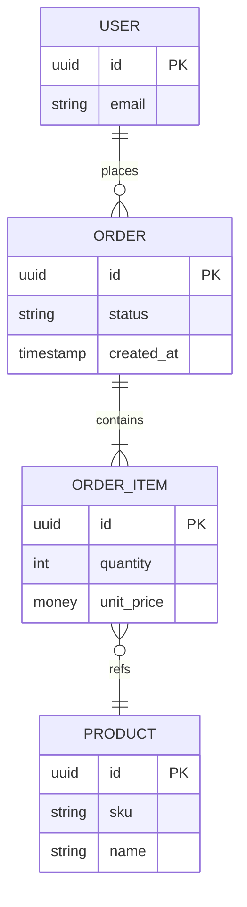

# [プロジェクト名] API設計書（Markdown雛形 / REST + OpenAPI 3.1）

> この雛形は**外部公開REST API**を前提にした標準構成です。GraphQL/gRPCに差し替える場合は 4章（APIスタイル & 契約）と5章（リソース設計）のテンプレートを読み替えてください。
> なお、依頼により **9. Webhook/イベント** と **13. 運用・法務** は含めていません。

---

## 0. ドキュメント情報
- **版/状態**: v[0.1.0] / [Draft|Approved]
- **作成者 / 所有者**: [氏名 or チーム]
- **承認者**: [氏名]
- **更新日**: [YYYY-MM-DD]
- **対象読者**: [外部開発者 / SRE / CS / 法務など]
- **関連リンク**:
  - OpenAPI (YAML/JSON): [リンク]
  - リファレンス（自動生成）: [リンク]
  - Postman/Insomnia コレクション: [リンク]
  - SDK/CLI: [リンク]

### 変更履歴
| 日付 | 版 | 変更者 | 変更要約 |
|---|---|---|---|
| 2025-09-30 | v0.1.0 | [あなたの名前] | 初版作成 |

---

## 1. 概要と目的
### 1.1 背景
[API公開の背景、ビジネス価値、依存プロダクトなど]

### 1.2 目的
[APIで達成したいこと／成功指標（KPIや採用数、流量等）]

### 1.3 主要ユースケース（3〜5件）
- UC1: [誰が][何を][なぜ]
- UC2: ...
- UC3: ...

### 1.4 対象ユーザー / ペルソナ
[社外ISV、社内BFF、パートナー etc.]

---

## 2. スコープ定義
### 2.1 In Scope（提供機能）
- [例] 注文の作成/取得/更新/検索
- [例] 顧客の登録/検索

### 2.2 Out of Scope（非提供）
- [例] 課金処理は別API（Billing API）で提供

### 2.3 既知の制約・前提
- 整合性モデル: [強整合 / 最終的整合]
- データ鮮度: [最大N分遅延]
- リージョン: [AP-Northeast-1 など]
- 依存サービスSLO: [リンク]

---

## 3. ドメインモデル & 用語集
### 3.1 リソース関係図（例: Mermaid）

> 実際のエンティティ/関係を反映してください。

### 3.2 用語集
| 用語 | 定義 | 代表フィールド | 注意点 |
|---|---|---|---|
| 注文 | 顧客による購入要求 | `order.id` | 下書き/確定の状態遷移に注意 |
| 明細 | 注文に含まれる各商品行 | `order_item.id` | 金額は通貨・税を含む/含まないの統一 |
| 顧客 | 購入者 | `user.id` | 個人情報(PII)の扱い |

---

## 4. APIスタイル & 契約
### 4.1 スタイル
- **REST**（Resource-Oriented）
- **コンテンツタイプ**: `application/json; charset=utf-8`
- **スキーマ管理**: **OpenAPI 3.1** + JSON Schema 2020-12

### 4.2 ベースURL / 環境
| 環境 | ベースURL | 備考 |
|---|---|---|
| Sandbox | `https://sandbox.api.example.com/v1` | 無課金・サンプルデータ |
| Staging | `https://staging.api.example.com/v1` | 外部非公開 |
| Production | `https://api.example.com/v1` | 本番 |

### 4.3 バージョニング
- パスバージョン: `/v1`
- 非互換変更は **メジャー上げのみ**。既存 `/vN` は維持。
- 非互換変更の告知/移行: 90日告知 → 180日移行（例）

### 4.4 互換性ポリシー（例）
- 後方互換: フィールド追加、enum値の追加（未解釈は無視）
- 非互換: フィールド削除/意味変更、既定値変更、型変更

---

## 5. リソース設計
### 5.1 リソース一覧（抜粋テンプレート）
| リソース | パス | メソッド | 概要 | 権限/スコープ | 冪等性 | 備考 |
|---|---|---|---|---|---|---|
| Users | `/users` | GET | ユーザー検索 | `users:read` | - | ページング対応 |
| Users | `/users/{user_id}` | GET | ユーザー取得 | `users:read` | - |  |
| Orders | `/orders` | POST | 注文作成 | `orders:write` | **Idempotency-Key** | 予約→確定の遷移あり |
| Orders | `/orders/{order_id}` | PATCH | 注文更新 | `orders:write` | ETag/If-Match | 同時更新対策 |
| Orders | `/orders/{order_id}` | GET | 注文取得 | `orders:read` | - |  |
| Orders | `/orders` | GET | 注文検索 | `orders:read` | - | カーソルページング |

### 5.2 共通仕様
#### 5.2.1 URL/識別子
- リソースは名詞複数形。識別子は `UUID v4` を推奨
- ネストは最小限（例: `/orders/{order_id}/items`）

#### 5.2.2 ページング（カーソル）
- クエリ: `?limit=50&cursor=eyJvZmZzZXQiOjUw...`
- レスポンス例:
```json
{
  "data": [ /* 要素配列 */ ],
  "next_cursor": "eyJhIjoxMjM0fQ==",
  "has_more": true
}
```

#### 5.2.3 フィルタ/ソート/部分応答
- フィルタ例: `?status=CONFIRMED&created_from=2025-01-01T00:00:00Z`
- ソート例: `?sort=-created_at`（`-` は降順）
- 部分応答: `?fields=id,status,created_at`

#### 5.2.4 同時更新（ETag）
- 取得時に `ETag` を返却。更新系は `If-Match: <etag-value>` を必須化
- 競合時は `412 Precondition Failed`

#### 5.2.5 冪等性（Idempotency-Key）
- **POST**/PUT/PATCH に対し `Idempotency-Key`（最大長・有効期限を定義）
- 同一キーで重複送信時は**同一結果**を返却

#### 5.2.6 共通ヘッダ
| ヘッダ | 方向 | 必須 | 例 | 意味 |
|---|---|---|---|---|
| Authorization | Req | Yes | `Bearer <access_token>` | OAuth2 アクセストークン |
| Idempotency-Key | Req | POST系 | `550e8400-e29b-41d4-a716-446655440000` | 冪等性確保 |
| X-Request-Id | Req/Res | Yes | 任意のUUID | トレース用 |
| Accept | Req | Yes | `application/json` | 受理メディアタイプ |
| Content-Type | Req | 書込時 | `application/json` | 本文メディアタイプ |
| ETag | Res | 取得時 | `W/"abc123"` | 表現タグ |

#### 5.2.7 入力検証ルール（例）
- 日時: **UTC ISO 8601 (RFC3339)**、`Z` 終端
- 金額: 通貨は **ISO 4217**、最小単位/小数桁（例: JPY=整数、USD=2桁）
- 文字列長/enum 値/相関制約を JSON Schema に明記

### 5.3 リソース詳細テンプレート（コピペ用）
#### 5.3.x `<Resource>` 概要
- パス: `/<resources>` / `/<resources>/{id}`
- 説明: [役割]
- 権限/スコープ: [`<res>:read`, `<res>:write`]

##### 5.3.x.1 スキーマ
**リクエスト**（作成）例:
```json
{
  "name": "<string>",
  "...": "..."
}
```
**レスポンス**例:
```json
{
  "id": "uuid",
  "name": "<string>",
  "status": "<enum>",
  "created_at": "2025-01-01T00:00:00Z"
}
```

##### 5.3.x.2 エンドポイント
- `GET /<resources>`: 一覧/検索（ページング、フィルタ、ソート）
- `GET /<resources>/{id}`: 取得
- `POST /<resources>`: 作成（Idempotency-Key 必須）
- `PATCH /<resources>/{id}`: 更新（If-Match 必須）
- `DELETE /<resources>/{id}`: 削除（論理/物理の別を明記）

**ステータスコード**（例）: `200/201/204/400/401/403/404/409/412/422/429/500`

**curl例**（作成）:
```bash
curl -X POST \
  -H "Authorization: Bearer $TOKEN" \
  -H "Content-Type: application/json" \
  -H "Idempotency-Key: $(uuidgen)" \
  https://api.example.com/v1/<resources> \
  -d '{"name":"Example"}'
```

---

## 6. セキュリティ
### 6.1 認証
- **OAuth 2.1**:
  - Auth Code + PKCE（ユーザー委任）
  - Client Credentials（サーバ間）
- API Key は**最終手段**（権限最小化・ローテーションポリシー必須）
- mTLS: [要否]

### 6.2 認可
- スコープ設計: `resource:action` 形式（例: `orders:read`）
- JWTクレーム（例）:
```json
{
  "sub": "user-uuid",
  "aud": "api.example.com",
  "scope": "orders:read users:read",
  "exp": 1735689600
}
```

### 6.3 データ保護
- TLS 1.2+、HSTS、Perfect Forward Secrecy
- PII/機微データのマスキング方針（ログ/エラー/監査）
- シークレット管理（KMS/Vault）、鍵のローテーション

### 6.4 監査
- 重要操作は監査ログ（誰が・何を・いつ・どこから）

---

## 7. リクエスト/レスポンス共通
### 7.1 日時・タイムゾーン
- すべて **UTC**（ISO 8601、`Z`）

### 7.2 金額・通貨
- `amount`（整数 or 小数）、`currency`（ISO 4217）
- 税の含み/除きの定義をフィールドで明示

### 7.3 ローカライズ
- 表示用の言語/通貨は**クライアント側**で処理（APIは中立）

### 7.4 エラー設計（Problem Details）
- メディアタイプ: `application/problem+json`
- スキーマ（例）:
```json
{
  "type": "https://docs.example.com/errors/invalid-parameter",
  "title": "Invalid parameter",
  "status": 422,
  "detail": "'status' must be one of [PENDING, CONFIRMED]",
  "instance": "urn:request:550e8400-e29b-41d4-a716-446655440000",
  "code": "E422_001",
  "retryable": false,
  "invalid_params": [
    {"name":"status","reason":"unsupported value"}
  ]
}
```

#### 7.4.1 エラーコード表（雛形）
| HTTP | code | title | 典型原因 | クライアント対処 |
|---|---|---|---|---|
| 400 | E400_xxx | Bad Request | スキーマ/相関違反 | 入力修正 |
| 401 | E401_xxx | Unauthorized | トークン不正/期限切れ | 再認証 |
| 403 | E403_xxx | Forbidden | 権限不足/スコープ不足 | 権限付与 |
| 404 | E404_xxx | Not Found | ID不正/削除済み | ID確認 |
| 409 | E409_xxx | Conflict | 状態遷移/一意制約 | 再試行/状態確認 |
| 412 | E412_xxx | Precondition Failed | ETag不一致 | 再取得→再送 |
| 422 | E422_xxx | Unprocessable Entity | ビジネスルール違反 | 入力修正 |
| 429 | E429_xxx | Too Many Requests | レート超過 | バックオフ |
| 500 | E500_xxx | Internal Error | サーバ障害 | リトライ |

---

## 8. パフォーマンス & 信頼性
### 8.1 SLO（例）
- 可用性: **99.9%/月**
- p95 レイテンシ: **< 300ms**（読み取り）、**< 800ms**（書き込み）

### 8.2 レート制限/クォータ（例）
| キー種別 | 上限（短期） | 上限（長期） | リセット | 返却ヘッダ |
|---|---|---|---|---|
| IP単位 | 120 req/分 | 20,000 req/日 | ローリング | `X-RateLimit-*` |
| アクセストークン | 600 req/分 | 100,000 req/日 | ローリング | 同上 |

### 8.3 タイムアウト/リトライ
- クライアント推奨タイムアウト: **3–5秒**
- リトライ: **指数バックオフ + ジッター**（`retryable=true` のみ）

### 8.4 キャッシュ
- 弱整合のリソースは `Cache-Control: max-age=60, stale-while-revalidate=30`
- 変更検知: `ETag` / `Last-Modified`

---

## 10. オブザーバビリティ
### 10.1 トレーシング
- `X-Request-Id` を**必須**。分散トレースは W3C Trace Context（`traceparent`/`tracestate`）に準拠

### 10.2 ログ
- 構造化JSONログ（request_id, path, method, user_id/ client_id, status, latency, error_code）
- PIIはマスキング/除去

### 10.3 メトリクス
- レイテンシ（p50/p90/p95/p99）、スループット、エラー率、429率、バックエンド依存の失敗率

### 10.4 サポート時の連絡手順
- 問い合わせ時は **`X-Request-Id`** と発生時刻（UTC）を添付

---

## 11. 変更管理
### 11.1 ルール
- 互換変更: いつでも（通知任意だが推奨）
- 非互換変更: `/vN` でのみ実施、告知→移行期間（テンプレート下記）

### 11.2 非推奨化（Deprecation）通知テンプレ
1. アナウンス（T0）: Docs/メール/変更ログ
2. 非推奨フラグ付与: レスポンスヘッダ `Deprecation: true`, `Sunset: <date>`
3. 移行ガイド提供
4. 廃止（T0+180日 例）

### 11.3 リリースノート（例）
| 日付 | 版 | 変更 |
|---|---|---|
| 2025-10-15 | v1.2.0 | `orders` に `fulfillment_status` 追加 |

---

## 12. 開発者体験（DX）
### 12.1 クイックスタート（5分）
```bash
# 1) トークン取得（例: Client Credentials）
export TOKEN="<access_token>"

# 2) 疎通（ヘルスチェック or 自分の情報）
curl -H "Authorization: Bearer $TOKEN" \
  https://api.example.com/v1/health

# 3) 代表API（一覧）
curl -H "Authorization: Bearer $TOKEN" \
  'https://api.example.com/v1/orders?limit=2'
```

### 12.2 SDK/CLI
- 言語別SDK: [JavaScript], [Python], [Go] …
- バージョン整合: OpenAPI から自動生成。タグ付きリリースに追従

### 12.3 サンプル/検証用データ
- Sandboxにテナント `[demo]` を用意。種データ: [リンク]

### 12.4 よくある落とし穴（FAQ）
- `412 Precondition Failed` が出る: `GET`で`ETag`取得→`If-Match`付与して`PATCH`
- `409 Conflict`（状態遷移）: 遷移表を確認（リンク）
- 429（レート超過）: Backoffし、`Retry-After`に従う

---

## 付録A: OpenAPI 断片テンプレート
```yaml
openapi: 3.1.0
info:
  title: Example API
  version: 1.0.0
servers:
  - url: https://api.example.com/v1
paths:
  /orders:
    get:
      summary: List orders
      operationId: listOrders
      parameters:
        - in: query
          name: limit
          schema: { type: integer, minimum: 1, maximum: 100, default: 50 }
      responses:
        '200':
          description: OK
          content:
            application/json:
              schema:
                type: object
                properties:
                  data:
                    type: array
                    items:
                      $ref: '#/components/schemas/Order'
                  next_cursor: { type: string, nullable: true }
                  has_more: { type: boolean }
components:
  schemas:
    Order:
      type: object
      properties:
        id: { type: string, format: uuid }
        status: { type: string, enum: [PENDING, CONFIRMED, CANCELED] }
        created_at: { type: string, format: date-time }
```

## 付録B: HTTPステータスの標準対応（雛形）
| 操作 | 成功 | 主な失敗 |
|---|---|---|
| 取得(GET) | 200 | 401/403/404/429/500 |
| 作成(POST) | 201 | 400/401/403/409/422/429/500 |
| 更新(PATCH) | 200 | 400/401/403/404/409/412/422/429/500 |
| 削除(DELETE) | 204 | 401/403/404/409/429/500 |

---

> **運用メモ**: この雛形は、最小限の“守るべき原則”を強制しつつ、各プロダクト固有の要件を差し込めるように作ってあります。まずは 5章のリソース一覧を埋め、7章のエラー表と 11章の変更管理を同時に用意すると破綻しにくいです。