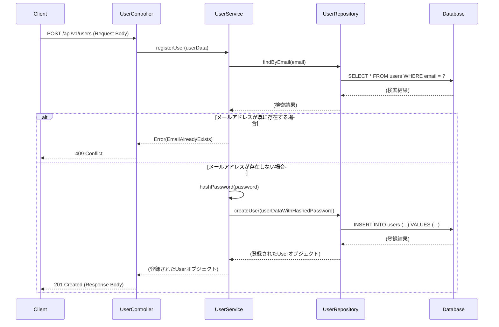

# 詳細設計書（バックエンド）

## 1. はじめに

### 1.1. 本書の目的

本書は、「（システム名）」のバックエンドに関する詳細設計を記述するものです。本設計書は、開発者が実装作業を行う際のインプットとなることを目的とします。

### 1.2. 範囲

本書は、以下のコンポーネントまたは機能の範囲を対象とします。

*   （例：ユーザー認証API）
*   （例：商品管理バッチ）

### 1.3. 参考資料

*   [要件定義書](http://)
*   [基本設計書](http://)
*   [API設計書](http://)
*   [データベース設計書](http://)

---

## 2. アーキテクチャ概要

（対象範囲の技術スタック、アーキテクチャパターン、ライブラリなどを簡潔に記述します。詳細は方式設計書などを参照するように促します。）

*   **プログラミング言語**:
*   **フレームワーク**:
*   **アーキテクチャ**: （例：クリーンアーキテクチャ, レイヤードアーキテクチャ）
*   **主要ライブラリ**:

---

## 3. 機能詳細設計

（基本設計で定義された機能を、実装可能なレベルまで詳細化して記述します。）

### 3.1. （機能ID） ユーザー登録機能

#### 3.1.1. 概要

ユーザーからの情報を受け取り、データベースに新しいユーザーを登録する。

#### 3.1.2. エンドポイント

（APIの場合）

| Method | URI |
| :--- | :--- |
| `POST` | `/api/v1/users` |

#### 3.1.3. クラス/モジュール構成

| クラス名/モジュール名 | 役割 |
| :--- | :--- |
| `UserController` | リクエストを受け取り、レスポンスを返す |
| `UserService` | ビジネスロジックを担当する |
| `UserRepository` | データベースとのやり取りを担当する |
| `User` | ユーザーのデータモデル |

#### 3.1.4. シーケンス図

#### 3.1.5. 処理フロー

1.  **入力**: リクエストボディ (JSON)
    *   `name` (string, 必須)
    *   `email` (string, 必須, email形式)
    *   `password` (string, 必須, 8文字以上)
2.  **バリデーション**:
    *   必須項目が全て存在することを確認する。
    *   `email`が正しい形式であることを確認する。
    *   `password`が8文字以上であることを確認する。
    *   バリデーションエラーの場合、`400 Bad Request`を返す。
3.  **主処理**:
    1.  `UserService`の`registerUser`メソッドを呼び出す。
    2.  `UserRepository`を使い、リクエストされた`email`が既にデータベースに存在するか確認する。
    3.  存在する場合、`EmailAlreadyExistsException`をスローし、`409 Conflict`を返す。
    4.  存在しない場合、パスワードをハッシュ化する。
    5.  ハッシュ化されたパスワードを含むユーザー情報を`UserRepository`に渡し、データベースに保存する。
    6.  保存されたユーザー情報を返す。
4.  **出力**:
    *   **成功時**: `201 Created`
        *   レスポンスボディ (JSON): 登録されたユーザー情報（パスワードは含まない）
    *   **失敗時**:
        *   `400 Bad Request`: バリデーションエラー
        *   `409 Conflict`: メールアドレス重複
        *   `500 Internal Server Error`: その他のサーバーエラー

#### 3.1.6. エラーハンドリング

| エラーケース | HTTPステータス | エラーコード（任意） | メッセージ |
| :--- | :--- | :--- | :--- |
| バリデーションエラー | 400 | `INVALID_INPUT` | 入力内容が正しくありません。 |
| メールアドレス重複 | 409 | `EMAIL_EXISTS` | そのメールアドレスは既に使用されています。 |
| データベース接続エラー | 500 | `DB_ERROR` | サーバーエラーが発生しました。 |
