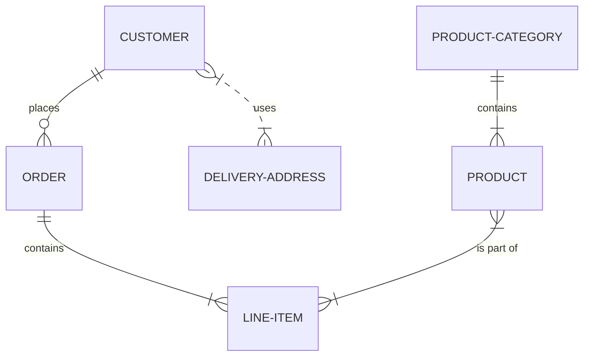

# データベース設計書

## 1. はじめに

### 1.1. 本書の目的

本書は、「（システム名）」のデータベース設計について記述するものです。本システムのデータベース構造、テーブル定義、インデックスなどを定義し、開発および保守の品質向上に資することを目的とします。

### 1.2. 範囲

（本書が対象とするデータベースの範囲を記述します。）

### 1.3. 参考資料

*   [要件定義書](http://)
*   [システム方式設計書](http://)

---

## 2. 論理設計

### 2.1. ER図 (Entity-Relationship Diagram)

（データベースの主要なエンティティとそれらの関連（リレーションシップ）を表現します。）

### 2.2. エンティティ定義

| 論理名 | 物理名（案） | 概要 |
| :--- | :--- | :--- |
| 顧客 | `customers` | サービスの利用者情報を管理する |
| 注文 | `orders` | 顧客からの注文情報を管理する |
| 製品 | `products` | 販売する製品の情報を管理する |

---

## 3. 物理設計

### 3.1. テーブル定義

#### 3.1.1. `customers` (顧客テーブル)

| カラム論理名 | カラム物理名 | データ型 | NOT NULL | PK | FK | デフォルト値 | 説明 |
| :--- | :--- | :--- | :--- | :--- | :--- | :--- | :--- |
| 顧客ID | `id` | `BIGINT UNSIGNED` | ✔ | ✔ | | | 主キー |
| 氏名 | `name` | `VARCHAR(100)` | ✔ | | | | |
| メールアドレス | `email` | `VARCHAR(255)` | ✔ | | | | 一意制約を付与 |
| 作成日時 | `created_at` | `DATETIME` | ✔ | | | `CURRENT_TIMESTAMP` | |
| 更新日時 | `updated_at` | `DATETIME` | ✔ | | | `CURRENT_TIMESTAMP` | `ON UPDATE CURRENT_TIMESTAMP` |

#### 3.1.2. `orders` (注文テーブル)

| カラム論理名 | カラム物理名 | データ型 | NOT NULL | PK | FK | デフォルト値 | 説明 |
| :--- | :--- | :--- | :--- | :--- | :--- | :--- | :--- |
| 注文ID | `id` | `BIGINT UNSIGNED` | ✔ | ✔ | | | 主キー |
| 顧客ID | `customer_id`| `BIGINT UNSIGNED` | ✔ | | ✔ | | `customers.id`への外部キー |
| 注文日時 | `ordered_at` | `DATETIME` | ✔ | | | | |
| 合計金額 | `total_price`| `INT UNSIGNED` | ✔ | | | | |

### 3.2. インデックス定義

| テーブル名 | インデックス名 | 対象カラム | UNIQUE | 説明 |
| :--- | :--- | :--- | :--- | :--- |
| `customers` | `uq_email` | `email` | ✔ | メールアドレスでの検索高速化と一意性保証のため |
| `orders` | `idx_customer_id` | `customer_id` | | 顧客IDによる検索高速化のため |

---

## 4. データディクショナリ

（プロジェクト内で使用するデータ項目（カラム）の標準的な命名規則や型、意味などを定義します。）

| データ項目（論理名） | 標準物理名 | 標準データ型 | 説明 |
| :--- | :--- | :--- | :--- |
| ID | `id` | `BIGINT UNSIGNED` | 主キー。自動採番。 |
| 作成日時 | `created_at` | `DATETIME` | レコードの作成日時。 |
| 更新日時 | `updated_at` | `DATETIME` | レコードの最終更新日時。 |

---

## 5. CRUDマトリクス

（各機能がどのテーブルに対してどの操作（Create, Read, Update, Delete）を行うかを示します。）

| 機能 | `customers` | `orders` | `products` |
| :--- | :--- | :--- | :--- |
| 顧客登録機能 | C | | |
| 顧客情報更新機能 | U | | |
| 商品検索機能 | | | R |
| 注文機能 | R | C | R |
| 注文履歴表示機能 | | R | |
