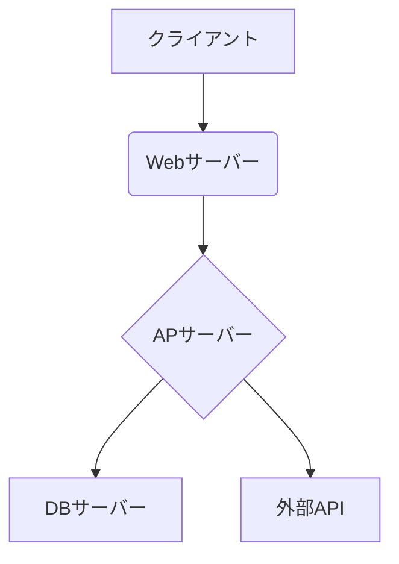
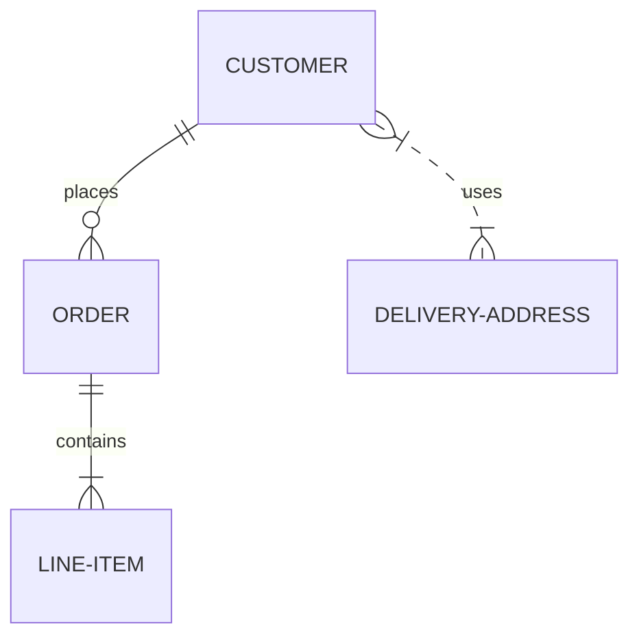
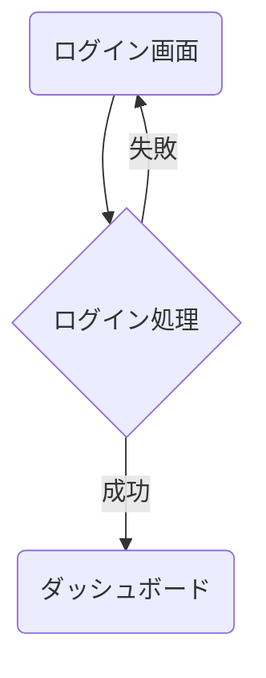

# システム方式設計書

## 1. はじめに

### 1.1. 本書の目的

本書は、「（システム名）」のシステム方式設計について記述するものです。本システムの全体像、機能要件、非機能要件、アーキテクチャなどを定義し、開発関係者間の認識を統一することを目的とします。

### 1.2. 背景

（このシステムを開発するに至った経緯や、解決したい課題などを記述します。）

### 1.3. 範囲

#### 1.3.1. 対象範囲

（本設計書が対象とする範囲を記述します。例：〇〇機能、△△サブシステムなど）

#### 1.3.2. 対象外範囲

（本設計書が対象としない範囲を記述します。）

### 1.4. 対象読者

本書は、以下の読者を対象としています。

*   プロジェクトマネージャー
*   システムエンジニア・プログラマー
*   テスター
*   運用・保守担当者

### 1.5. 用語定義

| 用語 | 説明 |
| :--- | :--- |
|      |      |
|      |      |

### 1.6. 参考資料

*   [要件定義書](http://)
*   [関連資料名](http://)

---

## 2. システム概要

### 2.1. システムの目的

（このシステムが達成すべきビジネス上の目的やゴールを記述します。）

### 2.2. システム構成図

（システムの全体像を示す図を記述します。コンポーネント、サブシステム、外部システムとの連携などを表現します。）

### 2.3. 利用技術

| 分類 | 技術・製品名 | バージョン | 備考 |
| :--- | :--- | :--- | :--- |
| OS | | | |
| プログラミング言語 | | | |
| フレームワーク | | | |
| データベース | | | |
| Webサーバー | | | |
| その他 | | | |

---

## 3. 機能要件

### 3.1. 機能一覧

| 大分類 | 中分類 | 機能ID | 機能名 | 概要 |
| :--- | :--- | :--- | :--- | :--- |
| 機能A | | A-001 | 〇〇登録機能 | 〇〇をシステムに登録する |
| | | A-002 | 〇〇検索機能 | 条件を指定して〇〇を検索する |
| 機能B | | B-001 | △△出力機能 | △△をCSV形式で出力する |

### 3.2. 機能詳細

#### 3.2.1. （機能ID） 〇〇登録機能

*   **概要**: （機能の概要）
*   **入力**: （画面項目、リクエストパラメータなど）
*   **処理**: （正常系、異常系の処理内容）
*   **出力**: （画面表示、レスポンスデータなど）

---

## 4. 非機能要件

### 4.1. 性能

*   **レスポンスタイム**: 各主要画面のレスポンスタイムは〇秒以内とする。
*   **スループット**: ピーク時に〇〇tps（transactions per second）を処理できること。

### 4.2. 可用性

*   **稼働率**: システム全体の稼働率は〇〇%以上とする。
*   **障害復旧時間**: 重篤な障害が発生した場合、〇時間以内に復旧すること。

### 4.3. 保守性・運用性

*   **コーディング規約**: （準拠するコーディング規約があれば記述）
*   **監視**: （監視項目や方法について記述）
*   **バックアップ**: （バックアップ対象、方式、世代数などを記述）

### 4.4. 移行性

（既存システムからのデータ移行やシステム切り替えに関する要件を記述します。）

### 4.5. セキュリティ

*   **認証**: （認証方式について記述）
*   **認可**: （アクセス制御の方針について記述）
*   **脆弱性対策**: （SQLインジェクション、XSSなどの脆弱性対策方針を記述）

---

## 5. システムアーキテクチャ

### 5.1. ハードウェア構成

（サーバー、ストレージなどの物理/仮想的なハードウェア構成を記述します。）

### 5.2. ソフトウェア構成

（OS、ミドルウェア、アプリケーションなどのソフトウェアコンポーネントの配置や関連を記述します。）

### 5.3. ネットワーク構成

（ネットワークセグメント、ファイアウォール、ロードバランサなどの構成を記述します。）

---

## 6. データ設計

### 6.1. ER図

（主要なエンティティとリレーションシップを示すER図を記述します。）

### 6.2. テーブル定義

#### テーブル名: `users`

| カラム名 | データ型 | NOT NULL | PK | FK | 説明 |
| :--- | :--- | :--- | :--- | :--- | :--- |
| id | int | ✔ | ✔ | | ユーザーID |
| name | varchar(255) | ✔ | | | 氏名 |
| email | varchar(255) | ✔ | | | メールアドレス |

---

## 7. 画面設計

### 7.1. 画面一覧

| 画面ID | 画面名 | URL | 概要 |
| :--- | :--- | :--- | :--- |
| SC-001 | ログイン画面 | /login | |
| SC-002 | ダッシュボード | /dashboard | |

### 7.2. 画面遷移図

---

## 8. バッチ設計

### 8.1. バッチ一覧

| バッチID | バッチ名 | 実行契機 | 概要 |
| :--- | :--- | :--- | :--- |
| BA-001 | 日次集計バッチ | 毎日 01:00 | 売上データを日次で集計する |

---

## 9. テスト計画

### 9.1. テスト方針

（単体テスト、結合テスト、総合テストなど、各テストフェーズの方針を記述します。）

### 9.2. テスト環境

（テストに使用する環境について記述します。）

---

## 10. 付録

（その他、補足資料があれば添付します。）
